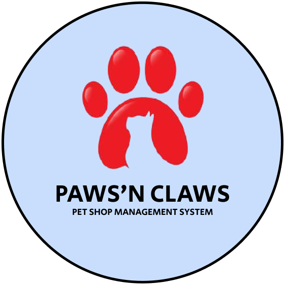

## Pet Shop Management System (Paws'n Claws)

### Introduction
The purpose of this project is to build an e-Commerce system for pet shop which is called Paws'n Claws for customer and staff. This project is a group project for two courses in my university which are TU3404 Software Development for Information System and TE3503 Software Testing.

### Business Problem
Paws'n Claws as a pet shop, is currently facing challenges in managing their sales and customer data. They also have limited visibility on their inventory and sales performance. To address these issues, our team will develop an e-Commerce system that enables customers to browse and purchase products, while providing the staff with tools to manage the store's inventory, orders and sales data. The system will feature functionalities such as account registration, category with product management, shopping cart, order management and dashboard reporting for staff to gain insights on their sales performance.

### Technologies
<b>Programming & Scripting Language: </b> HTML, CSS, Javascript, PHP  
<b>Framework & Libraries:  </b> Bootstrap, JQuery, Laravel, Google Chart  
<b>Database: </b>  MySQL

### List of Features
<ul>
    <li>Account Registration</li>
    <li>Log In</li>
    <li>Category Management</li>
    <li>Product Management</li>
    <li>Product Browsing</li>
    <li>Shopping Cart Management</li>
    <li>Order Management</li>
    <li>Dashboard Reporting</li>
</ul>

### Quick Demo

  

To visit our system, you can check out <a href="https://epawsnclaws.000webhostapp.com/" target="_blank">HERE</a>
        
### Group Members

<ul>
    <li><a href="https://github.com/aimanabdollah">Aiman - Developer</li>
    <li><a href="https://github.com/nadyranaaaaa">Nadyra - Project Manager</li>
    <li><a href="https://github.com/feezahmh">Hafeezah - System Analyst</li>
    <li><a href="https://github.com/Yuggen17">Yuggen - Tester</li>  
</ul>

